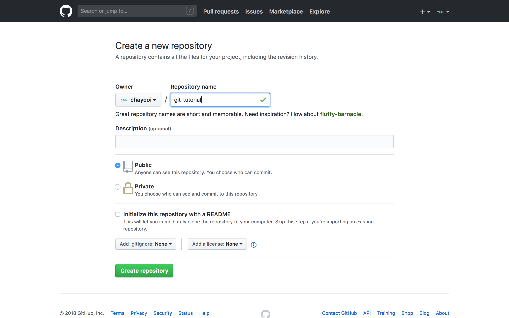

# 실습 환경 구성하기

  
본격적인 학습을 시작하기에 앞서, 웹 프론트엔드 개발에 필요한 최소한의 실습 환경을 함께 구성해보겠습니다.

## 텍스트 에디터: Visual Studio Code

소프트웨어를 개발하기 위해서는, 우리가 원하는 작업을 올바르게 수행하도록 컴퓨터에게 적절한 명령을 내릴 수 있어야 합니다. 그러나 컴퓨터는 우리가 일상에서 사용하고 있는 자연어를 이해하지 못하기 때문에 **사람과 컴퓨터가 모두 이해하고 소통할 수 있는 중간 매개체가 필요**한데, 그 매개체 역할을 하는 것이 바로 프로그래밍 언어입니다. 우리는 이것을 통해 컴퓨터에게 특정한 작업을 수행하도록 명령을 내릴 수 있습니다.

우리가 앞으로 학습하게 될 웹을 예로 들어보겠습니다. 보통의 경우, 하나의 웹 페이지를 구성하기 위해서 기본적으로 HTML과 CSS, 그리고 Javascript라는 세 종류의 언어를 사용합니다. 각 언어를 사용하여 우리는 .html, .css, .js 확장자를 갖는 파일을 작성하게 되는데, 이러한 파일들을 편집하기 위해서는 **텍스트 에디터**라는 특별한 도구가 필요합니다.

일반인들에게 가장 친숙한 텍스트 에디터로 윈도우의 메모장, 맥의 텍스트 편집기가 있습니다. 이들 에디터를 사용하더라도 앞서 언급했던 확장자를 갖는 파일을 작성하는 것이 가능하지만, 코드를 편집하는 일에 특화된 에디터가 아니기 때문에 개발을 할 때는 그리 유용하지 않습니다. 대신, 지금 소개할 Visual Sutdio Code를 사용하게 되면 코드 자동 완성, 문법 오류 검출 등 기타 유용한 확장 기능의 도움을 받으면서 개발 생산성을 크게 향상시킬 수 있습니다.

### Visual Studio Code

Visual Studio Code는 마이크로소프트에서 개발한 텍스트 에디터로, 개발에 편리한 각종 기능들을 제공합니다. 아래 링크를 통해 VSCode를 다운로드할 수 있습니다.

[Visual Studio Code 다운로드](https://code.visualstudio.com/docs/?dv=osx)

### Extension 설치

VSCode 마켓 플레이스에 들어가면 개발에 유용한 다양한 익스텐션들을 설치할 수 있습니다.

* Emmet: 매우 간단한 몇 가지 코드만 입력하면, 자동으로 완전한 HTML 코드를 생성해 주는 유용한 플러그인입니다. VSCode에 기본적으로 내장되어 있기 때문에 따로 설치하지 않아도 됩니다.
* Auto Close Tag: 오프닝 태그만 입력하면 자동으로 알아서 클로징 태그를 완성해주는 플러그인입니다.
* Auto Rename Tag: HTML 파일 내에서 이미 작성된 태그의 종류를 변경해야 할 때, 오프닝 태그와 클로징 태그 중 한 쪽만 수정해도 그에 대응하는 반대쪽 태그도 함께 수정시켜주는 플러그인입니다.
* Guides: Guides는 들여쓰기\(Indentation\) 깊이의 정도를 시각적으로 파악하기 쉽게 해줍니다.
* IntelliSense for CSS class names in HTML: HTML 파일의 `style` 태그 안에서 직접 선언되었거나 `link` 태그를 통해 연결된 외부 스타일 시트에 선언된 클래스명에 대하여, 몇 글자만 입력하면 자동 완성된 클래스명을 제안해주는 플러그인입니다.
* Live Server: Live Reload 기능이 포함된 로컬 서버를 실행하여 코드를 수정 후 저장할 때마다 자동으로 변경된 이력이 반영된 새 페이지를 로드해줍니다.
* Prettier: 우리가 작성한 코드가 항상 일관된 스타일을 유지할 수 있도록 들여쓰기 등 포맷과 관련된 부분을 이쁘게 정리해주는 매우 유용한 플러그인입니다.

## 웹 브라우저: Chrome, Firefox

동일한 웹 페이지라고 하더라도, 사용자가 이용하고 있는 브라우저의 종류에 따라 보여지는 결과물에는 조금 씩 차이가 있을 수 있습니다. 이는 **각 브라우저 별로 기본값으로 적용하고 있는 스타일\(User Agent Style Sheet\)도 다를 뿐더러, 특정 브라우저에서는 지원되지 않는 스타일 속성들이 존재하기 때문**인데요. 이런 이유로 인해 개발자는 사용자가 브라우저의 종류에 얽매이지 않고 항상 동일한 결과물을 받아볼 수 있도록 노력해야 합니다. 이 수업에서 우리는 Chrome과 Firefox 두 종류의 브라우저를 사용하여 우리가 작업한 결과물을 확인하도록 하겠습니다.

### Chrome

아래 링크로 이동해 Chrome 설치 파일을 다운로드합니다.

[Chrome 다운로드](https://www.google.co.kr/chrome/index.html)

Chrome 브라우저를 설치를 완료했다면, 개발에 유용한 몇 가지 확장 도구들을 더 설치해보도록 하겠습니다.

* [Web Developer](https://chrome.google.com/webstore/detail/web-developer/bfbameneiokkgbdmiekhjnmfkcnldhhm?hl=ko): CSS 스타일 속성 제거, 스크립트 제거 등 각종 요소를 비활성시킬 수 있는 기능을 제공하여 다양한 환경에 대한 테스트를 진행하거나, 화면 상의 픽셀을 측정할 수 있는 Ruler를 제공하는 등 웹 프론트엔드 개발에 도움이 될 만한 다양한 기능을 내장하고 있습니다.
* [headingsMap](https://chrome.google.com/webstore/detail/headingsmap/flbjommegcjonpdmenkdiocclhjacmbi?hl=ko): Heading의 구조에 따른 문서의 개요\(Outline\)를 추출해줍니다.
* [OpenWAX](https://chrome.google.com/webstore/detail/openwax/bfahpbmaknaeohgdklfbobogpdngngoe?hl=ko): 웹 접근성 관련 문제를 진단하기 위한 가이드라인을 제공해주는 툴입니다.

### Firefox

아래 링크로 이동해 Firefox 설치 파일을 다운로드합니다.

[Firefox 다운로드](https://www.mozilla.org/ko/firefox/new/)

Chrome 브라우저에 설치했던 Web Developer 툴을 Firefox에도 설치하겠습니다.

* [Web Developer](https://addons.mozilla.org/ko/firefox/addon/web-developer/?src=search)

## 버전 관리 시스템: Git

혹시, 아래와 같은 상황을 겪어보진 안았나요?

1. 내가 작업한 결과물의 다양한 버전을 만들기 위해 여러 개의 사본을 생성\(예시: 메인 칼라를 '빨강'에서 '파랑'으로 변경한 새로운 사본 생성\)
2. 최종 시안으로 생각했던 작업물이 클라이언트나 팀원의 요구에 따라 조금씩 변경될 때마다 '다른 이름으로 저장'하면서 최종이라고 이름 지어진 여러 개의 파일을 생성\(`최종.psd`, `최종 final.psd`, `진짜 최종.psd`...\)

매번 이러한 상황에 처했던 경험이 있다면 Git을 배울 차례입니다.

버전 관리 시스템이란 **파일의 변화를 시간에 따라 기록하여 과거 특정 시점의 버전을 다시 불러올 수 있는 시스템**을 일컫습니다.\(출처: Git 공식 문서\) Git은 이러한 버전 관리 시스템 중의 하나로, 빠른 속도와 Git의 가장 큰 특징 중 하나인 분산 모델이 갖는 수많은 장점으로 인해 개발자 사이에서 압도적인 점유율로 사용되어지고 있습니다.

Git이 어떤 일을 하는지 대략적인 감을 잡으셨다면, 지금부터는 Git을 설치하고 기본적인 사용법을 익혀보겠습니다.

### Git 설치하기

macOS에서 Git을 설치하는 대표적인 2가지 방법을 소개하겠습니다.

#### Git 공식 사이트에서 설치 파일을 다운로드

[Git 공식 사이트](https://git-scm.com/download/mac)로 이동하여 설치 파일을 다운로드할 수 있습니다. 다운로드가 완료되면 해당 파일을 실행하여 안내하는 절차를 따라 설치를 완료합니다.

#### Xcode를 통해 설치하기

Xcode는 애플이 만든 운영체제에서 동작하는 소프트웨어를 개발하기 위한 통합 개발환경\(IDE, Intergrated Development Environment\)입니다. Xcode를 설치하게 되면 기본적으로 '명령어 라인 도구\(Command Line Tools\)'가 함께 설치되고 명령어 라인 도구에는 Git을 비롯한 다양한 UNIX 스타일 명령어 툴들이 포함되어 있습니다. 때문에, Xcode 설치 한 번이면 Git도 함께 설치됩니다. Xcode는 Mac 앱 스토어에 접속하여 설치할 수 있습니다.

고작 '명령어 라인 도구'를 설치하고자 꽤나 큰 용량을 차지하는 Xcode를 설치하는 일이 비효율적으로 느껴질 수도 있습니다. 특별히 Xcode를 사용할 일이 없다면, '명령어 라인 도구'만 따로 내려받는 것 역시 가능합니다. 터미널을 실행 후 다음 명령을 입력하면 됩니다.\(터미널\(Ternminal\)은 GUI 위에서 동작하는 커맨드 라인 인터페이스\(CLI\)로, 맥 OS에 기본적으로 설치되어있습니다.\)

```bash
xcode-select --install
```

이후 대화상자가 나타나면 안내하는 순서에 따라 명령어 라인 도구 설치를 완료합니다. 아래 명령어를 실행했을 , 버전이 잘 출력된다면 정상적으로 설치가 완료된 것입니다.

```bash
git --version
```

### git 사용 설정하기

Git을 설치하고 나서 가장 먼저 해야 할 일은 사용자 이름과 이메일 주소를 설정하는 것입니다. 하나의 프로젝트 내에서 다양한 사람들과 협업하는 환경 속에서는 어떤 사람이 변경 이력을 기록\(commit\)한 것인지 확인할 수 있어야 하는데, Git은 이때 이 정보를 사용합니다.

터미널에서 다음 명령을 실행하여 전역\(global\)으로 Git 사용자 정보를 설정하겠습니다.

```bash
git config --global user.name "사용자 이름"
git config --global user.email "사용자 이메일 주소"
```

특정 프로젝트에만 사용자 정보를 다르게 기록하고 싶다면, 커맨드 라인에서 해당 프로젝트 폴더로 이동한 후 `--global` 옵션을 붙이지 않고 사용자 이름과 이메일 주소를 설정하면 됩니다. 별도로 설정하지 않는다면, 앞으로 일어나는 모든 커밋은 전역에서 설정한 사용자 정보로 기록될 것입니다. 방금 설정한 정보가 어떻게 기록되는지에 대해서는 잠시 후에 살펴보겠습니다.

### Git 기본 사용법

Git은 기본적으로 커맨드 라인 인터페이스\(CLI\) 위에서 다뤄지는 툴이기 때문에, 지금은 우선 터미널을 통해 실습하면서 Git의 기본적인 사용법을 익혀보겠습니다.

먼저 실습을 진행하기 위해 터미널을 실행해주세요. 처음 실행했을 때 터미널 상에서 우리가 위치해있는 곳은 루트 디렉토리입니다. 루트 디렉토리는 터미널 상에서 틸드 기호\(`~`\)로 표시됩니다. 이제, 루트 디렉토리 바로 하위에 실습을 위한 폴더 하나를 생성하겠습니다. 다음 명령을 실행해주세요.

```bash
mkdir git-tutorial
```

`mkdir`은 'make directory'의 약어로, 폴더를 생성하기 위한 UNIX 명령어입니다. 위 명령을 올바로 실행했다면 루트 디렉토리 하위에 'git-tutorial' 폴더가 생성되었을 겁니다. `ls` 명령을 실행하여 폴더가 잘 생성되었는지 확인해주세요. 'list'를 뜻하는 `ls` 명령어는 현재 디렉토리에 위치한 파일 및 폴더의 목록을 출력해줍니다.

```bash
ls
```

실습 폴더로 이동하기 위해서는 `cd` 명령을 실행하면 됩니다. `cd`는 'change directory'를 의미합니다.

```bash
cd git-tutorial
```

> 점 하나\(`.`\)는 현재 위치해있는 디렉토리를, 점 두 개\(`..`\)는 상위 디렉토리를 의미합니다. 또한 슬래시\(`/`\)를 사용하여 디렉토리 간의 종속 관계를 나타낼 수 있습니다. 예를 들어, 현재 위치한 곳에서 상위 디렉토리로 이동하고 싶다면 `cd ..`, 상위의 상위 디렉토리로 이동하고 싶다면 `cd ../..`과 같이 실행합니다.

#### git init: Git 저장소로 초기화

이제 본격적으로 Git을 사용해볼 차례입니다.

현재 우리가 위치해있는 폴더\(git-tutorial\)의 변경 이력을 Git으로 관리하기 위해서는 해당 폴더를 Git 저장소로 초기화하는 작업이 필요합니다. 다음 명령을 실행해주세요.

```bash
git init
```

이제 파인더에서 해당 폴더를 열고 숨김 파일을 표시해보면, `.git` 폴더를 확인할 수 있을텐데요. Git은 이 폴더를 통해 초기화된 로컬 저장소의 변경 이력을 관리하게 됩니다. 만약 이 폴더를 삭제하면, Git은 더 이상 해당 폴더의 변경 이력을 추적하지 않을 겁니다.

> 터미널에서 `open .` 명령을 실행하면 파인더에서 현재 폴더를 실행시켜줍니다. 숨김 파일을 표시하기 위한 단축 키는 `⌘(Command) + ⇧(Shift) + .`입니다.

또 하나 이전과 달라진 점은, 터미널 상에서 현재 폴더 이름 옆에 'master'가 표시된다는 것입니다. 이 표시는 저장소에서 현재 작업 중인 브랜치가 'master' 브랜치임을 의미하는데요. 브랜치에 대해서는 잠시 후에 다시 살펴보도록 하겠습니다.

#### git add: 변경 이력 추적

이제 방금 초기화한 Git 로컬 저장소에 새 변경 이력을 만들고 Git을 통해 변경 사항을 기록해볼 차례입니다. 다음 명령어를 통해 현재 폴더에서 VSCode를 실행해주세요.

```bash
code .
```

'A.js' 파일을 생성 후 다음과 같이 입력합니다.

```javascript
console.log('Hello, Git!')
```

새 변경 이력을 만들어졌습니다! 이렇게 변경된 이력을 Git으로 기록하기 위해서는, 먼저 특정 파일의 변경된 이력을 추적해달라고 Git에게 알려야 합니다. `git add [파일명]` 명령으로 이같은 일을 수행할 수 있습니다.

```bash
git add A.js
```

#### git commit: 변경 이력 기록

여기까지 마쳤으면 첫 번째 변경 이력을 기록하기 위한 준비는 모두 마친 것입니다. `git commit` 명령을 실행하여 최종적으로 변경 이력을 기록하겠습니다.

```bash
git commit
```

별다른 설정을 하지 않았다면 위 명령을 실행했을 때, 커밋 메세지를 편집하기 위한 vim 에디터가 실행될 것입니다. 그러나 개발을 처음 배우는 단계에서 vim 에디터의 사용법까지 익히는 건 불필요한 시간 낭비일 수 있으니, 지금은 정말 필요한 것을 배우는 데 집중하기로 하고 넘어가겠습니다. 현재 vim 에디터 창에서 `:q`를 입력 후 엔터를 한 번 누르면 커밋 이력을 남기지 않고 이전 화면으로 빠져나올 수 있습니다.

한 줄짜리 간단한 커밋 메세지만 남기려면 `-m` 옵션을 사용할 수 있습니다. 앞으로 실습을 진행하는 동안에는 굳이 복잡한 커밋 메세지를 남기지 않고 `-m` 옵션을 써서 간단하게 기록하도록 하겠습니다.

```bash
git commit -m "Initial commit"
```

혹시, `git add`가 불필요한 단계 같다고 느끼진 않았나요? 굳이 `git add`를 실행할 필요없이 그냥 `git commit`을 실행했을 때 변경이 발생한 모든 파일이 한 번에 기록되면 좋을텐데요. 이런 상황이라면 `git commit`을 실행할 때 'all'을 뜻하는 `-a` 옵션을 붙여서, `git add` 단계를 생략하고 변경이 발생한 모든 파일을 한꺼번에 커밋하는 것도 가능합니다. 예를 들면 아래와 같습니다.

```bash
git commit -am "Initial commit"
```

그러나 변경 이력이 발생한 파일이 여러 개이고 그 중에 특정 파일들만 선별적으로 커밋하고 싶은 상황이라면, `git add` 명령을 통해서 추적할 파일들을 직접 선택해주는 단계가 필요할 것입니다.

#### git branch: 새 작업 흐름 생성

다음으로 '브랜치'라는 개념에 대해 알아보겠습니다. 기본적으로 Git을 사용할 때는 위와 같이 파일을 추가하고, 수정하고, 커밋하는 과정을 반복하면서 프로젝트를 진행하면 됩니다. 그러던 중, 기존 프로젝트에는 영향을 주지 않으면서 새로운 실험적 기능을 개발해야 하는 상황을 마주하게 됐다고 생각해봅시다. 예전에 하던 방식처럼 프로젝트의 또 다른 사본을 생성해서 작업을 진행해야 할까요?

`git branch` 명령어를 이용하면 현재 프로젝트를 통째로 복사하고 붙여 넣기 할 필요 없이 브랜치만 옮기는 것으로 완전히 다른 작업 흐름을 가져가는 일이 가능해집니다. `git init` 명령을 수행하고 난 후에 터미널 상에서 폴더 이름 옆에 'master'라고 표시된 부분을 확인할 수 있었죠? Git 저장소로 초기화하게 되면, 기본적으로 우리가 작업하고 있는 브랜치가 master라는 이름으로 만들어집니다.

새로운 브랜치를 만들고 싶다면 `git branch [브랜치 이름]`을 실행하면 됩니다. 여기서는 'feature'라는 이름의 브랜치를 생성하겠습니다.

```bash
git branch feature
```

이제 브랜치 이름을 넣지 말고 그냥 `git branch` 명령만 실행해 봅시다. 현재 어떤 브랜치가 있는지 확인할 수 있는 명령어입니다. 'master'와 'feature'라는 두 개의 브랜치가 있는 걸 확인할 수 있을 겁니다. 자세히 살펴보면 'master' 앞에 `*`가 붙어있는 것을 확인할 수 있는데, 이는 지금 작업 중인 브랜치가 'master'임을 의미합니다.

#### git checkout: 작업 브랜치 변경

우리는 현재 'master' 브랜치에 위치하고 있습니다. 그런데 우리는 'master' 브랜치의 기존 작업 내용에 어떤 영향도 주지 않는 상태에서 실험적인 새 기능을 개발하길 원하므로, 방금 생성했던 'feature' 브랜치로 작업 브랜치를 변경해야 합니다. 이때 사용하는 명령어가 바로 `git checkout`입니다. 'feature' 브랜치로 작업 브랜치를 변경하기 위해서는 터미널에 아래와 같이 입력합니다.

```bash
git checkout feature
```

이 명령을 실행하고 나면, 터미널 상에서 폴더 이름 옆에 'master'로 적혀있던 부분이 'feature'로 변경되었을 겁니다. 또 `git branch` 명령을 다시 한 번 실행했을 때 'master' 앞에 있던 `*`가 'feature' 앞으로 이동된 것을 확인할 수 있습니다.

브랜치를 만들고 나서 체크아웃을 하는 단계적 과정이 조금 귀찮게 느껴진다면, 이 두 가지 작업을 한 번에 수행하는 방법도 있습니다. 다음 명령을 수행하면 브랜치를 생성하는 동시에 해당 브랜치로 체크아웃됩니다.

```bash
git checkout -b [브랜치 이름]
```

'feature' 브랜치에 새로운 변경 이력을 만들겠습니다. 'A.js' 파일을 아래와 같이 수정합니다.

```javascript
console.log('Hello, Git!')
console.log('Hello, Mash-Up!')
```

'B.js' 파일도 생성한 다음 아래와 같이 작성해주세요.

```javascript
console.log('Hello, World!')
```

두 파일을 Git에게 추적하도록 알리겠습니다. `git add A.js B.js`와 같이 실행해도 되지만, `git add .`을 하면 변경 이력이 발생한 모든 파일에 대하여 추적하도록 할 수 있습니다. 여기서는 'A.js', 'B.js' 두 파일에 변경 이력이 생겼으므로, 두 파일 모두 Git에 의해 추적될 것입니다.

```bash
git add .
```

바로 이어서 두 번째 커밋까지 진행하겠습니다.

```bash
git commit -m "Second commit"
```

> 위 예시에서는 특별한 의미가 없는 커밋 메세지를 작성하고 있지만, 실제 프로젝트를 진행할 때에는 어떤 작업 내용을 기록하기 위한 커밋이었는지 한 눈에 파악할 수 있도록 적어주는 것이 좋습니다.

다음 단계로 진행하기 전에, 터미널에서 `git log` 명령을 실행해보세요. 지금까지 우리가 남긴 두 개의 커밋 이력이 기록되었음을 확인할 수 있습니다. 또한 제일 앞에서 설정했던 사용자 정보가 해당 커밋의 Author로 기록되었네요. 만약 앞에서 사용자 정보를 설정하지 않았더라면 Author에 아무것도 쓰여있지 않아 어떤 사람이 기록한 커밋인지 알기 힘들었을 겁니다.

다시 브랜치에 대한 이야기로 돌아가보겠습니다. 우리가 방금 기록한 커밋은 'feature' 브랜치의 작업 내용에 관한 것입니다. 때문에 앞서 말한 대로라면, 'master' 브랜치의 작업 내용은 변경되지 않고 독립적으로 유지되어 있어야 합니다. 'master' 브랜치로 체크아웃하여 확인해보도록 하죠.

```bash
git checkout master
```

별 탈 없이 잘 따라오셨다면, 'master' 브랜치의 이전 작업 내용은 잘 유지되어있을 겁니다.

#### git merge: 브랜치 병합

'feature' 브랜치에서 작업한 내용을 'master' 브랜치로 합치고 싶다면 'master' 브랜치로 checkout한 다음 아래 명령을 실행하면 됩니다. 아래 명령을 실행하면 현재 위치해있는 'master' 브랜치에 'feature' 브랜치의 작업 내용이 병합됩니다.

```bash
git merge feature
```

#### git push: 로컬 저장소의 작업 내용을 원격 저장소로 올리기

지금까지 소개한 기능들을 잘 숙지했다면 혼자 Git을 사용하는 데는 별다른 문제가 없을 것입니다. 그러나 Git은 무엇보다 협업 도구로서의 의미가 큽니다. 현재까지는 로컬 저장소에서만 작업했지만, 지금부터는 다른 사람들과 협업할 수 있도록 내 로컬 저장소를 인터넷 상의 원격 저장소에 연결하고 로컬 저장소에서 작업한 내용을 원격 저장소로 올리는 방법에 대해 살펴보겠습니다.

Git 기반의 원격 저장소를 제공하는 서비스는 여러 가지가 있는데, 그 중에서 우리는 가장 유명하고 널리 사용되고 있는 [Github](https://github.com/)을 이용하도록 하겠습니다. 계정이 없다면 새로 만들어주세요.

로그인을 마치셨다면, 우측 상단의 '+' 버튼을 누른 후 'New repository'를 선택해주세요. 새 원격 저장소를 생성하기 위함입니다.



* 'Repository name'은 로컬 저장소에 만들었던 폴더 이름과 동일하게 git-tutorial로 짓겠습니다.
* Description 항목은 해당 저장소에 대한 간략한 설명을 기입하는 것으로, 생략하셔도 무방합니다.
* Public과 Private는 해당 원격 저장소를 외부에 공개할 것인지 말 것인지를 정하는 옵션입니다. Private 저장소로 사용하려면 비용을 지불해야 하기 때문에, Public으로 생성하도록 합니다. Public 저장소는 무제한으로 생성할 수 있습니다.
* README.md 파일을 생성하지 않을 것이므로 'Initialize this repository with a README' 항목은 체크하지 않습니다.

위와 같이 설정을 마친 후, 'Create repository' 버튼을 클릭하여 원격 저장소를 생성합니다.

이제, 해당 원격 저장소를 우리가 작업했던 로컬 저장소와 연동하는 과정이 필요합니다. 터미널에서 우리가 작업했던 폴더로 이동한 후 다음 명령을 실행합니다. \[저장소 Git URL\]에는 브라우저 주소 창의 URL을 붙여넣는 것이 아니라, 원격 저장소 생성 후 상단부에 위치한 URL을 붙여넣어야 한다는 것에 주의해주세요.

```bash
git remote add origin [저장소 Git URL]
```

위 명령은 **해당 URL을 갖는 원격 저장소를 현재 위치한 내 로컬 저장소에 origin이라는 이름으로 추가\(연동\)하겠다**는 의미를 갖습니다. 이 명령을 실행하고 난 뒤부터 로컬 저장소에서 작업한 내용을 연동된 원격 저장소로 올릴 수 있습니다. 이 작업을 수행하기 위한 명령이 바로 `git push`입니다. 터미널에서 다음 명령을 실행하세요.

```bash
git push -u origin master
```

이 명령은 내 로컬 저장소의 master 브랜치를 원격 저장소\(origin\)의 master 브랜치로 푸쉬하는 작업을 수행합니다. 만약 'master' 대신 'feature'를 입력한다면, 로컬 저장소의 feature 브랜치를 원격 저장소\(origin\)의 master 브랜치로 푸쉬하는 작업을 수행할 것입니다. 사실, `-u` 옵션은 꼭 붙이지 않아도됩니다. 여기서 'u'는 upstream을 뜻하는데, 이 옵션을 붙여서 한 번 실행하고 난 뒤부터는 `git push`까지만 입력해도 자동으로 `git push origin master`를 실행한 것과 같은 작업을 수행하도록 해줍니다.

#### Finished

여기까지 해서 Git의 기본적인 사용법에 대해 살펴봤습니다. Git에는 지금까지 소개한 기능 외에도 알아두면 유용한 명령어들이 굉장히 많습니다. 어쩌다보니 Git에 대한 설명이 길어졌지만 Git을 배우는 것이 이 스터디의 목적이 아니었으므로 여기까지만 살펴보기로 하겠습니다. 더 많은 기능을 알아보고 싶다면 [이 글](https://rogerdudler.github.io/git-guide/index.ko.html)을 한 번 읽어보시는 걸 추천드립니다.

