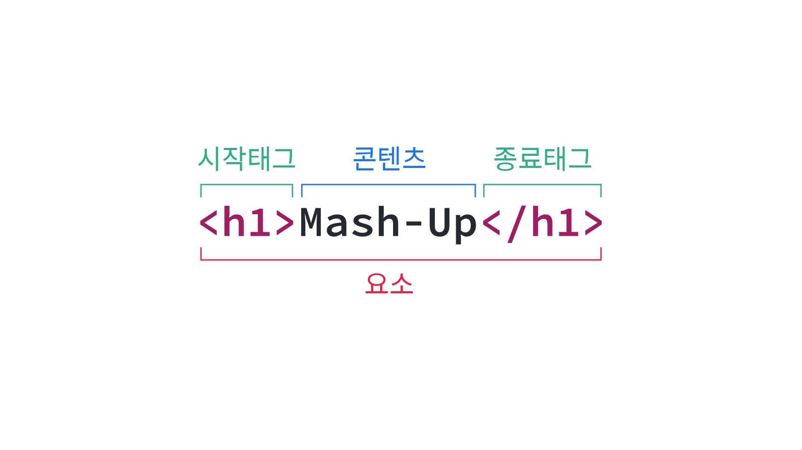
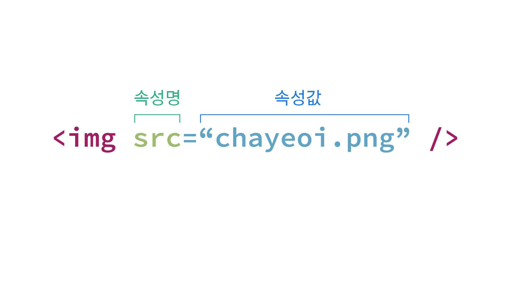

# HTML5 개요

## HTML이란

HTML\(Hyper Text Markup Language\)은 **하이퍼텍스트 기술과 마크업을 통해 문서를 기술하는 언어**로, 인터넷을 이용하여 문서를 작성하고 공유하기 위한 목적으로 팀 버너스 리가 처음 설계하였습니다.

> 하이퍼텍스트: 하이퍼링크를 통해 한 문서에서 다른 문서로 즉시 접근할 수 있는 텍스트를 말합니다.
>
> 마크업 언어: 문서가 화면에 표시되는 형식을 나타내거나 데이터의 논리적인 구조를 명시하기 위한 규칙들을 정의한 언어의 일종입니다. 데이터를 기술한 언어라는 점에서 프로그래밍 언어와는 차이가 있습니다.

```markup
<h1>Hello, HTML!</h1>
```

기본적으로 HTML은 위와 같이 `<tag>`와 `</tag>` 사이에 콘텐츠를 넣어주는 형식으로 문서를 기술하게 됩니다. 여기서 `h1`은 HTML에서 '태그'라 불리는 것으로, 문서의 가장 큰 제목을 의미하는 태그입니다. 이 외에도 단락, 항목 등 다양한 의미를 주기 위한 태그들이 존재합니다.

## 새로운 표준, HTML5

원래 HTML의 표준화 작업은 W3C에서 담당하고 있었습니다. 그런데 1990년대 중반, 당시의 HTML로는 문서를 구조화하는 데에는 한계가 있었고, 이를 해결하고자 1996년에 사용자가 직접 태그를 정의할 수 있는 XML이 등장하였습니다. 이에 W3C는 2000년부터 HTML의 개발을 중단하고 XML과 HTML을 융합한 XHTML을 표준화하려는 움직임을 보였습니다.\(이 당시 HTML의 최신 표준안은 HTML4.01이었습니다.\) 그러나 그 과정에서 XHTML이 하위 호환 상에 치명적인 문제가 있다는 사실이 발견되었습니다.

2004년, W3C 회의에서 모질라 재단과 오페라 소프트웨어는 새로운 HTML 표준 제안서를 제출하였습니다. 그러나 "웹의 혁명을 위한 기존의 지향점에 위배된다"는 이유로 거절되었고, 이에 애플, 모질라 재단, 오페라 소프트웨어는 WHATWG\(Web Hypertext Application Technology Working Group\)라는 웹 표준 공개 그룹을 독자적으로 설립하여 W3C와는 별개로 새로운 웹 표준인 Web Application 1.0과 Web Forms 2.0을 만들었습니다.

2007년 3월, XHTML의 표준화 작업을 이어가던 W3C는 결국 공개적으로 XHTML 2.0의 실패를 인정하였고 새롭게 HTML을 개발하기로 결정하면서 WHATWG의 표준안을 대부분 수용하여 HTML5가 탄생하게 되었습니다.

## HTML5 기본

### 요소

시작과 종료 태그 사이의 범위를 '요소'라고 합니다. 다음 예에서 `<h1>`는 시작 태그, `</h1>`는 종료 태그이고, 시작 태그와 종료 태그 사이에 컨텐츠가 위치합니다. 시작 태그부터 종료 태그까지 전체를 묶어서 요소\(Element\)라고 합니다. 요소는 HTML을 구성하는 가장 기본적인 단위입니다.



요소는 중첩될 수 있습니다. 즉, 요소는 다른 요소를 포함할 수 있습니다. 이때 부모와 자식 관계가 성립되고, HTML은 이러한 관계로 정보를 구조화합니다.

```markup
<!DOCTYPE html>
<html>
  <head>
    <meta charset="utf-8">
    <title>Mash-Up Study</title>
  </head>
  <body>
    <div>
      <h1>안녕하세요</h1>
    </div>
  </body>
</html>
```

콘텐츠를 갖지 않는 요소들도 있습니다. 대표적으로, 'img' 태그가 있습니다. 이런 요소들을 빈 요소\(Empty Element 또는 Self-closing Element\)라고 부릅니다.

```markup

```

### 속성

요소에 다양한 옵션 설정 역할을 하는 것이 속성입니다. 속성은 각 요소에 공통적으로 사용할 수 있는 것이 있는가 하면, 특정 요소에만 사용할 수 있는 것도 있습니다. 아래 예제에서는 이미지를 나타내는 'img' 태그에 'src' 속성으로 이미지 파일의 경로를 지정하고 있습니다.



### HTML 문서의 기본 구조

HTML 문서는 기본적으로 다음과 같은 구조를 따릅니다.

* DOCTYPE을 선언하여 사용할 HTML의 종류를 선언합니다. HTML5 문서는 `<!DOCTYPE html>`로 시작합니다.
* DOCTYPE 선언 후 2행부터 실제 HTML 문서를 기술하게 되는데, 최상단의 루트 요소로 'html' 요소를 갖습니다. 'head'와 'body' 부분으로 나뉩니다.
* 'head' 요소 안에는 문서의 제목, 외부 파일 참조, 메타 데이터 참조 등의 기본 정보를 기술 합니다. 이 정보들은 브라우저에 표시되지 않습니다.
* 브라우저의 화면에 출력될 모든 내용은 'body' 요소 안에 기술합니다.

## 시맨틱 웹

대부분의 인터넷 사용자는 원하는 정보를 취득하기 위해 Google이나 Naver와 같은 검색사이트를 이용합니다. 그렇기 때문에 웹 사이트는 검색 엔진에의 노출이 매우 중요합니다. 당연한 것이 검색엔진에 노출되지 않는 웹사이트에는 접속하는 이도 없기 때문이죠.

SEO\(검색 엔진 최적화, Search Engine Optimization\)같은 마케팅 도구를 사용하여 검색엔진이 본인의 웹사이트를 검색하기 알맞은 구조로 웹 사이트를 조정하기도 하는데, 이것은 기본적으로 검색엔진이 웹사이트 정보를 어떻게 수집하는지 아는 것으로 부터 시작됩니다.

검색엔진은 로봇\(Robot\)이라는 프로그램을 이용해 매일 전세계의 웹사이트 정보를 수집합니다.\(이것을 크롤링이라 하며 검색엔진의 크롤러가 이를 수행합니다.\) 그리고 검색 사이트 이용자가 검색할 만한 키워드를 미리 예상하여 검색 키워드에 대응하는 인덱스\(색인\)을 만들어 둡니다.\(이것을 인덱싱이라 하며 검색엔진의 인덱서가 이를 수행합니다.\)

인덱스를 생성할 때 사용되는 정보는 검색 로봇이 수집한 정보인데, 이것은 결국 웹사이트의 HTML 코드죠. 즉, 검색 엔진은 HTML 코드 만으로 그 의미를 인지하여야 하는데 이때 시맨틱 요소\(Semantic element\)를 해석하게 됩니다.

HTML로 작성된 문서는 컴퓨터가 해석할 수 있는 메타데이터와 사람이 사용하는 자연어 문장이 뒤섞여 있습니다. 아래 코드를 보면 1행과 2행은 브라우저에서 동일한 외형을 갖습니다. 이는 `h1` 태그의 디폴트 스타일이 1행과 같기 때문입니다.

```markup
<font size="6"><b>Hello</b></font>
<h1>Hello</h1>
```


그러나 1행의 요소는 의미론적으로 어떤 의미도 가지고 있지 않습니다. 즉, 의도가 명확하지 않습니다. 개발자가 의도한 요소의 의미를 명확하게 나타내지 않고 다만 폰트 크기와 볼드체를 지정하는 메타데이터만을 브라우저에게 알리고 있습니다. 그러나 2행의 요소는 header\(제목\) 중 가장 상위 레벨이라는 의미를 내포하고 있어서 개발자가 의도한 요소의 의미가 명확히 드러나고 있습니다. 이것은 코드의 가독성을 높이고 유지보수를 쉽게 만듭니다.

검색엔진은 대체로 h1 요소 내의 콘텐츠를 웹문서의 중요한 제목으로 인식하고 인덱스에 포함시킬 확률이 높습니다. 또한 사람도 h1 요소 내의 콘텐츠가 제목임을 인식할 수 있습니다. 시맨틱 요소로 구성되어 있는 웹페이지는 검색엔진에 보다 의미론적으로 문서 정보를 전달할 수 있고 검색엔진 또한 시맨틱 요소를 이용하여 보다 효과적인 크롤링과 인덱싱이 가능하게 됩니다. 즉, 시맨틱 태그란 브라우저, 검색엔진, 개발자 모두에게 콘텐츠의 의미를 명확히 설명하는 역할을 합니다. 시맨틱 태그에 의해 컴퓨터가 HTML 요소의 의미를 보다 명확히 해석하고 그 데이터를 활용할 수 있는 시맨틱 웹이 실현될 수 있는 것입니다.

시맨틱 웹이란 웹에 존재하는 수많은 웹페이지들에 메타데이터\(Metadata\)를 부여하여, 기존의 잡다한 데이터 집합이었던 웹페이지를 ‘의미’와 ‘관련성’을 가지는 거대한 데이터베이스로 구축하고자 하는 발상입니다.

HTML 요소는 non-semantic 요소, semantic 요소로 구분할 수 있습니다.

* non-semantic 요소: div, span 등이 있으며 이들 태그는 content에 대하여 어떤 설명도 하지 않습니다.
* semantic-요소: form, table, img 등이 있으며 이들 태그는 content의 의미를 명확히 설명합니다.

## 참고 자료

