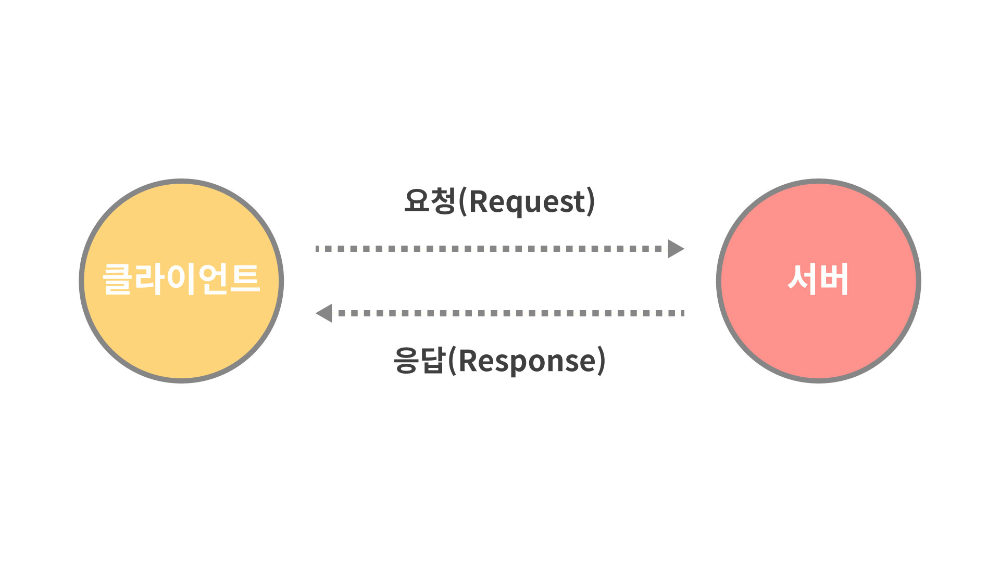

# Web

많은 사람들이 웹과 인터넷을 동의어로 혼동하지만, 정확히 말하면 이 둘은 같지 않습니다. 1960년대 후반 처음 등장한 인터넷은 **전 세계적으로 연결된 컴퓨터 네트워크**를 일컫는 말로, FTP, e-mail, Telnet과 같이 인터넷 위에서 동작하는 수많은 서비스들이 존재합니다. 보통 줄여서 웹이라고 일컫는 WWW\(World Wide Web\)은 그러한 수많은 서비스 중의 하나에 불과한 것으로, 컴퓨터와 컴퓨터 사이에 HTML 문서를 주고 받을 수 있도록 만든 서비스를 말합니다. 그런데 이들 중 가장 성공한 서비스가 웹이였기 때문에 웹과 인터넷을 동의어처럼 사용하게 된 것입니다.

웹에 대해 좀 더 자세히 이야기해보겠습니다. 웹은 1989년 3월, 유럽 입자 물리 연구소\(CERN\)의 소프트웨어 공학자였던 팀 버너스 리\(Tim Berners-Lee\)가 전 세계의 대학 및 연구소들 간에 문서를 신속하고 효율적으로 교환할 용도로 처음 고안하였습니다. 이를 위해 그는 컴퓨터와 컴퓨터 사이에 정보를 주고 받도록 하기 위한 최초의 웹 브라우저와 웹 서버를 개발하였고, 이들 사이의 통신 규약인 HTTP, 웹 문서를 기술하는 언어인 HTML를 고안하였는데요. 웹 탄생으로부터 대략 30년이 흐른 지금까지도 이들은 모두 웹의 근간을 이루고 있는 기술로 사용되어지고 있습니다.

웹을 개발한 지 얼마 지나지 않아, 팀 버너스 리와 유럽 입자 물리 연구소\(CERN\)는 이 웹이라는 서비스를 어떠한 저작권도 없이 완전히 무료로 공개하기로 합니다. 이에 따라 웹은 폭발적으로 성장하기 시작했고 현재는 거의 모든 다른 인터넷 시스템의 기능들을 흡수하면서 또다른 소프트웨어 플랫폼으로써의 지위를 누리고 있습니다.

## 웹의 동작 원리

웹의 기본적인 동작 원리는 매우 단순합니다. 웹 브라우저\(클라이언트\)가 미리 지정된 URL을 통해 웹 서버\(서버\)에게 요청\(Request\)을 보내면, 웹 서버는 요청에 알맞은 HTML 문서를 웹 브라우저에게 응답\(Response\)합니다. 이후 웹 브라우저는 응답받은 HTML 문서를 파싱\(parsing\)하여 사용자의 화면에 그려주게 됩니다.

> 웹 브라우저와 웹 서버는 소프트웨어입니다. 웹 브라우저는 웹 서버에게 요청을 보내고, 웹 서버는 웹 브라우저에게 응답합니다. 웹 브라우저가 설치된 컴퓨터를 클라이언트\(Client\)라 하고, 웹 서버가 설치된 컴퓨터를 서버\(Server\)라고 부릅니다.

## 웹의 발전

초창기 웹의 형태는 이게 전부였습니다. 그런데 HTML로 작성된 문서는 어떠한 스타일적인 요소도 갖지 않고 단순한 텍스트로만 구성된 멋없는 문서였기 때문에, 사람들은 HTML 문서를 좀 더 아름답게 꾸밀 수 있는 방법을 원했습니다. 그렇게 해서 문서의 스타일 속성을 기술하는 언어인 CSS가 만들어졌습니다.

CSS가 생겨난 지 얼마 지나지 않아 사람들은 사용자와 상호작용할 수 있는 동적인 웹 페이지를 만들고 싶은 욕구가 생겼습니다. 예를 들면, 사용자의 마우스 움직임을 따라 반짝이는 효과가 생겨나는 식으로 말입니다. 이런 부분에 한정적으로 사용할 목적으로 오직 브라우저 위에서만 동작 가능한 Javascript라는 기술이 탄생했습니다.

> Javascript의 탄생은 이토록 매우 허접했습니다. 그러나 몇 번의 역사적인 사건을 계기로, 오늘날의 자바스크립트는 이러한 태생적 한계를 극복하고 다양한 분야에서 활용될 수 있는 가장 강력한 프로그래밍 언어 중 하나로 탈바꿈하는 데 성공했습니다.

사람들은 자신이 만든 웹 사이트의 규모가 커지기 시작하면서, 생산성에 대해 고민하기 시작했습니다. 예를 들어, 사용자가 우리가 만든 웹 사이트에 로그인 요청을 보냈을 때 현재 로그인한 사용자의 이름과 함께 "◯◯◯님, 환영합니다!" 메세지를 출력하는 HTML 문서를 응답해야 한다고 해봅시다. 기존 방식을 따른다면, 개별 유저에 대한 환영 메세지를 포함한 HTML 문서를 하나 씩 만들어놓아야 할 것입니다. 유저가 100만 명이라면 100만 개의 HTML 파일이 필요하겠네요. 이에 더해 혹시라도 환영 메세지를 "◯◯◯님, 어서오세요!"로 변경해야 할 일이 생긴다면, 100만 개의 HTML 파일을 일일이 수정해줘야 할 것입니다. 상상만 해도 정말 끔찍한 일이었습니다. 이런 문제를 해결하고자, 클라이언트로부터 요청이 들어왔을 때 요청에 담겨온 정보와 결합하여 동적으로 HTML 문서를 만들어 응답해주도록 하는 PHP, JSP, Ruby on Rails와 같은 서버 사이드 기술들이 등장하게 되었고, 이런 기술들로 인해 생산성은 비약적으로 향상될 수 있었습니다.

이와 함께 웹에서 처리하는 데이터가 폭증함에 따라, 데이터를 효율적으로 처리할 필요가 생겨났습니다. 이런 요구로 인해 데이터를 전문적으로 다루는 MySQL과 같은 기술이 생겨나게 된 것입니다.

모바일 시대로 접어들면서, 사용자가 우리가 만든 웹 사이트를 모바일 환경에서 접속하더라도 데스크톱 PC로 접속할 때와 유사한 사용자 경험을 제공할 방법이 필요했습니다. 모바일 웹은 데스크톱 PC로 접속할 때보다 상대적으로 많이 느렸기 때문입니다. 다행히 자바스크립트의 놀라운 발전 덕분에, 클라이언트의 요청이 발생할 때마다 서버 측에서 완성된 HTML 파일을 응답받는 대신 화면을 그리기 위해 필요한 데이터만 응답받은 후 실제 렌더링은 클라이언트에서 처리하는 일이 가능해졌습니다. 이를 통해 클라이언트와 서버의 통신 비용이 크게 줄어들어 모바일 환경에서도 빠른 속도로 화면을 그려줄 수 있게 되었습니다. 또한 이렇게 만든 웹 어플리케이션은 요청이 발생할 때마다 HTML 파일을 새로 로드하는 것이 아니라, 하나의 HTML 파일 내에서 자바스크립트를 통해 동적으로 내용물을 변경하기 때문에 SPA\(Single Page Application\)라고 불리게 되었습니다. SPA 개발을 돕는 클라이언트 사이드 기술로 등장한 것들이 바로 React, Vue, Angular와 같은 자바스크립트 라이브러리 또는 프레임워크입니다.

## 프론트엔드와 백엔드

이토록 현대의 웹은 초창기와 다르게 매우 복잡해졌습니다. 지금처럼 웹이 복잡하지 않았던 과거에는 개발자 한 명이 혼자서 모든 부분을 개발하는 게 가능했지만, 점차 웹의 기능이 복잡해짐에 따라 혼자서 웹 개발의 모든 영역을 담당하는 것은 사실상 불가능해졌습니다. 이렇게 해서 웹 개발의 영역은 크게 사용자와 맞닿아있는 클라이언트 사이드를 개발하는 프론트엔드 영역과 클라이언트의 요청에 따라 적절한 결과를 응답하기 위한 서버 사이드를 개발하는 백엔드 영역으로 나뉘어졌습니다.

과거에는 프론트엔드 개발자가 하는 일이 많지 않았습니다. 좀 더 정확히 이야기하자면, 웹 개발의 주요한 비즈니스 로직은 모두 백엔드 영역에서 이루어졌기 때문에, 프론트엔드 엔지니어라는 직군이 존재하지 않았습니다. 비즈니스 로직 이외에 HTML 마크업과 CSS 스타일링, 가벼운 자바스크립트 코드를 담당하는 직군을 웹 퍼블리셔라고 호칭했었습니다.

그러나 앞서 이야기한 듯이, 모바일 시대로 접어들면서부터 보다 더 나은 사용자 경험을 제공하는 웹 어플리케이션을 만들기 위해 서버 사이드 영역에서 처리하던 많은 부분이 클라이언트 사이드 영역으로 넘어오게 되었고, 이에 따라 클라이언트 사이드에서 이런 로직에 대한 처리를 담당할 새로운 직군이 필요해졌습니다. 그렇게 해서 비교적 최근에 프론트엔드 엔지니어라는 직군이 새롭게 생겨난 것입니다.

