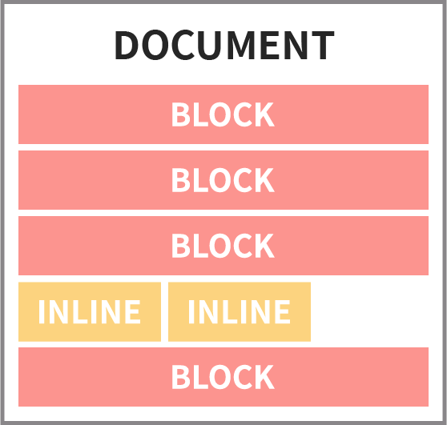

# HTML5 Basic

## 마크업 요소

HTML로 마크업되지 않은 문서는 어느 부분이 제목인지, 그에 관련되는 내용이 어디부터 어디까지인지 파악하기 힘들기 때문에 정보로서의 가치가 떨어집니다. 따라서 웹 문서를 작성할 때는 HTML 태그를 사용하여 각각의 콘텐츠 내용에 적절한 의미를 부여해줌으로써 사람과 컴퓨터로 하여금 문서의 구조를 해석하기 쉽게 만들어줄 필요가 있습니다. 적절한 방식으로 마크업된 문서는 스크린 리더와 같은 음성 보조 장치에서도 내용을 더 정확하게 읽을 수 있기 때문에 접근성 또한 높아집니다.

이번 챕터에서는 앞으로 자주 접하게 될 태그들을 위주로 가볍게 살펴본 후, 이어서 간단한 실습을 진행해보도록 하겠습니다.

### 기본

* `<html>`: html 태그는 모든 HTML 요소의 부모 요소이며 웹 페이지에 단 하나만 존재합니다. html 태그에는 관례적으로 문서의 언어 코드를 알리기 위해 `lang` 속성을 함께 명시합니다. 대표적인 언어코드에는 ko\(한국어\), en\(영어\), ja\(일본어\) 등이 있습니다.

  ```markup
  <html lang="ko">
  </html>
  ```

* `<head>`: 문서의 제목, 문자 코드, 키워드 지정, 외부 파일 연결 등 문서의 메타데이터를 기재하기 위한 요소입니다. head 태그 안에 작성한 내용들은 화면에 출력되지 않습니다.
* `<body>`: 문서의 본문 요소로, 실제 화면에 출력되는 HTML 문서의 내용이 body 태그 안에 작성됩니다.

### head

* `<title>`: HTML 문서의 제목을 정의하는 요소로, 검색엔진 최적화\(SEO\)에도 매우 중요합니다. 정의된 제목은 브라우저 탭에 표시됩니다.

  ```markup
  <title>Welcome to Mash-Up!</title>
  ```

* `<meta>`: 문자 코드나 문서의 개요, 키워드 등 브라우저 화면에 나타나지 않는 문서 정보를 기술하는 데 필요한 요소입니다. 주요 meta 요소의 속성은 다음과 같습니다.

  * `charset`: HTML5로 작성된 문서 내에서 문자 코드를 지정하기 위한 속성입니다. 반드시 이 속성 값을 'utf-8'로 지정해줘야 한글이 깨져보이지 않습니다.
  * `name="description"`: 문서의 개요를 나타내기 위한 속성입니다. 이 속성은 검색엔진에 의해 사용되므로 검색엔진 최적화\(SEO\)를 위해 중요합니다.
  * `name="keywords"`: 웹 페이지가 검색 엔진에서 어떤 키워드에 노출될지를 지정하기 위한 속성입니다. 검색엔진 최적화\(SEO\)를 위해 중요합니다.

  ```markup
  <meta charset="utf-8">
  <meta name="description" content="Mash-Up 스터디 자료">
  <meta name="keywords" content="Mash-Up, HTML, CSS">
  ```

* `<style>`: CSS를 HTML 문서 내에 직접 기술할 때 사용합니다.

  ```markup
  <html>
    <head>
      <style>
        .container {
          background-color: green;
        }
      </style>
    </head>
    <body>
      <div class="container">Mash-Up</div>
    </body>
  </html>
  ```

* `<link>`: 스타일 시트와 같은 외부 리소스를 HTML 문서에 연결할 때 사용합니다.

  ```markup
  <html>
    <head>
      <link rel="stylesheet" href="style.css">
    </head>
    <body>
      <div class="container">Mash-Up</div>
    </body>
  </html>
  ```

* `<script>`: HTML 문서에 외부 자바스크립트 파일을 연결하거나 자바스크립트 코드를 직접 기술할 때 사용합니다.

  ```markup
  <html>
    <head>
      <script src="index.js"></script>
      <script>
        alert('Hello, HTML!');
      </script>
    </head>
  </html>
  ```

### body

문서의 실제 콘텐츠를 표현하기 위한 태그들은 모두 'body' 태그 안쪽에 위치하게 됩니다. 'body' 내에 위치하는 태그들은 모두 기본 디스플레이 스타일이라는 것을 갖고 있는데, 이 속성 값에 따라서 해당 태그를 사용한 콘텐츠가 실제 화면에서 어떤 방식에 따라 배치될 것인지 정해지게 됩니다. display 속성은 앞으로 배우게 될 CSS를 이용해서 얼마든지 변경할 수 있습니다.



> 지금 당장 모든 태그를 무작정 외우려고 하지 마세요! 지금은 우선 가벼운 마음으로 어떤 종류의 태그들이 있는지 살펴본 다음, 나중에 실제로 마크업을 사용해 문서를 작성하다보면 어느새 자연스럽게 터득되어질 것입니다. 어떤 태그를 사용해야할 지 감이 잘 오지 않을 땐 그때그때 검색을 통해 해결해나가면 됩니다.

* `<section>`: 장이나 절 등으로 구성할 수 있는 콘텐츠 섹션을 정의할 때 사용합니다. \(디스플레이 스타일: block\)
* `<nav>`: 문서의 주요 내비게이션을 정의할 때 사용합니다. \(디스플레이 스타일: block\)
* `<article>`: 재배포할 가치가 있는 독립된 콘텐츠를 정의할 때 사용합니다. \(디스플레이 스타일: block\)
* `<aside>`: 본문 콘텐츠와 연관성이 적은 콘텐츠를 정의할 때 사용합니다. \(디스플레이 스타일: block\)
* `<header>`: 페이지나 섹션 등의 헤더를 정의할 때 사용합니다. \(디스플레이 스타일: block\)
* `<main>`: 문서의 주요 콘텐츠 영역을 정의할 때 사용하며, 문서에는 단 하나의 'main' 요소만 존재할 수 있습니다. \(디스플레이 스타일: block\)
* `<footer>`: 페이지나 섹션 등의 푸터를 정의할 때 사용합니다. \(디스플레이 스타일: block\)
* `<h1> ~ <h6>`: 콘텐츠 블록의 제목을 정의할 때 사용합니다. \(디스플레이 스타일: block\)
* `<div>`: 콘텐츠 블록의 시맨틱한 의미를 가지고 있지는 않지만, 디자인이나 개발 이슈로 인해 콘텐츠 블록을 그룹화하고자 할 때 사용합니다. \(디스플레이 스타일: block\)
* `<p>`: 단락 콘텐츠를 정의할 때 사용합니다. \(디스플레이 스타일: block\)
* `<ul>`: 순서가 없는 목록을 마크업할 때 사용합니다. \(디스플레이 스타일: block\)
* `<ol>`: 순서가 있는 목록을 마크업할 때 사용합니다. \(디스플레이 스타일: block\)
* `<li>`: 순서형 또는 비순서형 목록의 항목을 정의할 때 사용합니다. \(디스플레이 스타일: block\)
* `<dl>`: 정의형 목록을 마크업하고자 할 때 사용합니다. \(디스플레이 스타일: block\)
* `<dt>`: 정의형 목록의 용어 제목을 의미합니다. \(디스플레이 스타일: block\)
* `<dd>`: 정의형 목록의 용어 설명을 의미합니다. \(디스플레이 스타일: block\)
* `<figure>`: 이미지, 오디오, 비디오, 표 등을 포함하는 그룹 영역을 의미합니다. 'figcaption'과 함께 사용되어 캡션을 정의할 수 있습니다. \(디스플레이 스타일: block\)
* `<figcaption>`: 'figure' 요소에 포함된 콘텐츠에 대한 캡션을 정의할 때 사용합니다. \(디스플레이 스타일: block\)
* `<blockquote>`: 인용 콘텐츠 블록을 정의할 때 사용합니다. \(디스플레이 스타일: block\)
* `<pre>`: 공백이나 줄바꿈 등의 입력 형식 그대로 화면에 렌더링하고자 할 때 사용합니다. \(디스플레이 스타일: block\)
* `<a>`: 하이퍼링크를 지정할 때 사용합니다. \(디스플레이 스타일: inline\)
* `<em>`: 텍스트를 강조하고자 할 때 사용합니다. \(디스플레이 스타일: inline\)
* `<strong>`: 특별히 중요한 콘텐츠의 의미를 부여하고자 할 때 사용합니다. \(디스플레이 스타일: inline\)
* `<i>`: HTML5에서 의미가 변한 요소로, 그 이전에는 단순히 콘텐츠를 이탤릭체 스타일로 표현하는 데 사용되었으나\(non-semantic\) 최근에는 전문 용어, 관용구 또는 아이콘 스타일을 적용하기 위한 용도로 사용됩니다. \(디스플레이 스타일: inline\)
* `<br>`: 텍스트를 줄바꿈하는 용도로 사용됩니다. 그러나 최근에는 줄바꿈을 위한 본래의 용도로도 잘 사용되지 않는 추세입니다. 대신 `p` 태그를 사용하여 문단을 구분하는 방법이 더 선호됩니다.
* `<span>`: 인라인 텍스트를 그룹화하기 위한 용도로 사용하는 Non-semantic 태그입니다. \(디스플레이 스타일: inline\)
* `<q>`: 인라인 인용구를 정의할 때 사용합니다. \(디스플레이 스타일: inline\)
* `<abbr>`: 축약어를 정의할 때 사용합니다. \(디스플레이 스타일: inline\)
* `<del>`: 삭제된 콘텐츠를 정의할 때 사용합니다. \(디스플레이 스타일: inline\)
* ``: 이미지를 삽입할 때 사용합니다. \(디스플레이 스타일: inline-block\)
* `<iframe>`: 인라인 프레임을 삽입할 때 사용합니다. \(디스플레이 스타일: inline-block\)
* `<video>`: 비디오 콘텐츠를 삽입할 때 사용합니다. \(디스플레이 스타일: inline-block\)
* `<audio>`: 오디오 콘텐츠를 삽입할 때 사용합니다. \(디스플레이 스타일: inline-block\)
* `<source>`: 비디오 및 오디오의 폴백 콘텐츠를 삽입할 때 사용합니다. \(디스플레이 스타일: none\)
* `<canvas>`: 동적인 비트맵 이미지를 삽입할 때 사용합니다. \(디스플레이 스타일: inline-block\)
* `<table>`: 테이블을 삽입할 때 사용합니다. \(디스플레이 스타일: table\)
* `<caption>`: 테이블의 캡션을 정의할 때 사용합니다. \(디스플레이 스타일: table-caption\)
* `<thead>`: 테이블의 제목 행을 정의할 때 사용합니다. \(디스플레이 스타일: table-row-group\)
* `<tbody>`: 테이블의 본문 행을 정의할 때 사용합니다. \(디스플레이 스타일: table-header-group\)
* `<tfoot>`: 테이블의 푸터 행을 정의할 때 사용합니다. \(디스플레이 스타일: table-footer-group\)
* `<tr>`: 테이블의 행을 정의할 때 사용합니다. \(디스플레이 스타일: table-row\)
* `<th>`: 테이블의 제목 셀을 정의할 때 사용합니다. \(디스플레이 스타일: table-cell\)
* `<td>`: 테이블의 내용 셀을 정의할 때 사용합니다. \(디스플레이 스타일: table-cell\)
* `<form>`: 폼 서식이 포함될 영역을 정의할 때 사용합니다. \(디스플레이 스타일: block\)
* `<fieldset>`: 서로 연관이 있는 폼 서식을 그룹화할 때 사용합니다. \(디스플레이 스타일: block\)
* `<legend>`: 'fieldset' 요소로 그룹화한 폼의 목적을 명시할 때 사용합니다.
* `<label>`: 폼 서식의 레이블을 정의할 때 사용합니다. \(디스플레이 스타일: inline\)
* `<input>`: 한줄 입력상자,라디오 버튼,체크박스 등 다양한 폼 서식을 마크업할 때 사용합니다. \(디스플레이 스타일: inline-block\)
* `<button>`: 전송, 취소 등 버튼 서식을 삽입할 때 사용합니다. \(디스플레이 스타일: inline\)
* `<select>`: 리스트나 목록 상자로 된 서식을 삽입할 때 사용합니다. \(디스플레이 스타일: inline\)
* `<optgroup>`: 리스트나 목록 상자 서식의 항목 그룹을 정의할 때 사용합니다.
* `<option>`: 리스트나 목록 상자 서식의 항목을 정의할 때 사용합니다.
* `<textarea>`: 여러 줄 입력 상자를 삽입할 때 사용합니다. \(디스플레이 스타일: inline\)

이 외에도 정말 다양한 종류의 태그들이 존재합니다. 각 태그에 대한 자세한 설명 또는 더 많은 태그에 대한 정보를 얻으려면 아래 사이트를 방문해보세요.

* [MDN - HTML Elements Reference](https://developer.mozilla.org/en-US/docs/Web/HTML/Element)
* [HTML5 Open Reference](http://html5ref.clearboth.org/)
* [HTML Dog](http://www.htmldog.com/references/html/tags/)

## 기본적인 마크업 작성 규칙

HTML5로 마크업을 작성할 때 주의사항 및 권장되는 방식에 대해 알아보겠습니다.

### 종료 태그의 처리

HTML5에서 종료 태그는 생략할 수 있습니다. 즉, `<p></p>`처럼 쓰지 않고 `<p>`로 쓰는 일이 가능합니다. 그러나 이와 같이 종료 태그를 생략할 수 있다고는 하지만, 기존 XHTML 1.0의 규칙처럼 시작과 종료 태그를 정확히 명시하여 정형식\(Well-Formed\) 구조로 마크업할 것을 권장합니다.

```markup
<!-- OK -->
<p>

<!-- Recommended -->
<p></p>
```

### 대소문자의 사용

시작 태그와 종료 태그는 물론, 속성 이름에 대문자, 소문자를 모두 사용할 수 있습니다. 그러나 기존 XHTML 1.0의 규칙에 따라 소문자만 사용할 것을 권장합니다.

```markup
<!-- OK -->


<!-- Recommended -->

```

### 빈 요소

'img' 태그와 같이 종료 태그를 갖지 않는 빈 요소들이 있습니다. 기존 HTML4.01에서는 `` 형식으로, XHTML1.0에서는 `` 형식으로 선언해야 하며, HTML5에서는 두 가지 방식을 모두 허용하고 있습니다.

```markup
<!-- OK -->


<!-- OK -->

```

### 속성\(Attribute\)과 값\(Value\)

논리 속성\(참 또는 거짓 값만 갖는 속성\)의 경우 속성값 지정을 생략할 수 있습니다.

```markup
<!-- OK -->
<select multiple="multiple"></select>

<!-- Recommended -->
<select multiple></select>
```

속성값을 지정할 때 인용 부호를 생략할 수도 있고 홀따옴표 또는 겹따옴표를 사용하여 구분할 수도 있습니다. \(개인적으로는 겹따옴표를 사용하여 구분하는 방법을 선호합니다.\)

```markup
<!-- OK -->


<!-- OK -->


<!-- Recommended -->

```

### 태그의 올바른 중첩 사용

시작 태그와 종료 태그의 중첩에 문제가 발생하지 않도록 주의해야 합니다.

```markup
<!-- Never -->
<p>Mash <strong>Up!</p></strong>

<!-- OK -->
<p>Mash <strong>Up!</strong></p>
```

### 콘텐츠 모델

HTML에서 요소의 구조를 정리할 때는 명확한 규칙이 있습니다. 어느 요소 안에 어떤 요소를 넣을 수 있는지를 정한 규칙을 '콘텐츠 모델'이라 합니다. HTML5 콘텐츠 모델은 생각보다 굉장히 복잡하기 때문에 처음 배울 때는 단순한 개념으로 파악해 두는 것이 이해하기 쉽습니다.

단순한 개념이란 HTML5 이전의 HTML 버전에서 정해놓은 **블록 요소 / 인라인 요소**라는 분류 방법으로 생각하는 것입니다.

HTML5 이전의 버전에서는 거의 모든 요소가 '블룍 요소'와 '인라인 요소' 두 가지 카테고리로 분류되었습니다. 블록 요소란 표제, 단락, 항목, 표 등과 같은 문서 구조의 골조를 구성하는 요소군이며, 이들을 말하자면 정보의 그릇이라 할 수 있습니다.

그릇 안에는 내용물이 들어갑니다. HTML의 내용물이란 텍스트 데이터나 이미지 등과 같은 콘텐츠입니다. 인라인 요소는 이 내용물이 되는 콘텐츠에 의미를 부여하는 용도로 사용되는 요소로, 그 자체가 텍스트 데이터와 같은 취급을 받는 텍스트 레벨의 요소입니다.

이처럼 HTML의 요소를 크게 두 종류의 카테고리로 나눠 생각했을 때 콘텐츠 모델로서 알아야 할 규칙은 단 한 가지, '**블록 안에 인라인을 넣을 수는 있지만 거꾸로는 허용되지 않는다**'는 것입니다. 그릇 안에 내용물을 넣을 수는 있으나 내용물 안에 그릇을 넣을 수는 없는 것과 같은 원리입니다.

가장 간단하게 블록 / 인라인 요소를 구분하는 방법은 그 요소를 기술했을 때 브라우저 화면에서 자동으로 줄이 바뀌는지 바뀌지 않는지를 확인하는 것입니다. 자동적으로 줄이 바뀌면 블록 레벨 요소, 바뀌지 않으면 인라인 레벨 요소라고 알아두면 됩니다.


`a` 요소의 경우, HTML5에서 transparent 콘텐츠 모델로 변경되었기 때문에 `a` 태그를 사용해 블록 레벨 요소를 감싸는 것이 가능해졌습니다.


### HTML 엔티티

HTML 엔티티는 HTML에서 특정 캐릭터들이 예약되어있기 때문에 표기의 혼란을 막기 위해서 사용하는 것입니다. 예를 들어, HTML 문서에서 `<` 문자를 사용하고자 할 때 이를 그대로 사용한다면 HTML 문서는 `<` 문자가 태그를 여는 것으로 판단하기 떄문에 우리가 원했던 결과가 올바르게 표시되지 않습니다. 이런 경우가 몇 가지 더 존재하는데, 흔히 공백을 `&nbsp;`로 쓰거나 `<`, `>`를 `&lt;` `&gt;`처럼 쓰는 것들이 이에 해당합니다.

[HTML 엔티티 레퍼런스](https://dev.w3.org/html5/html-author/charref)에서 자세한 내용을 확인할 수 있습니다.

## References

* [MDN - HTML Elements Reference](https://developer.mozilla.org/en-US/docs/Web/HTML/Element)
* [HTML5 Open Reference](http://html5ref.clearboth.org/)
* [HTML Dog](http://www.htmldog.com/references/html/tags/)
* [MDN - HTML](https://developer.mozilla.org/ko/docs/Web/HTML)
* [W3C - HTML Spec](http://html5.clearboth.org/spec)
* [HTML 엔티티 레퍼런스](https://dev.w3.org/html5/html-author/charref)

