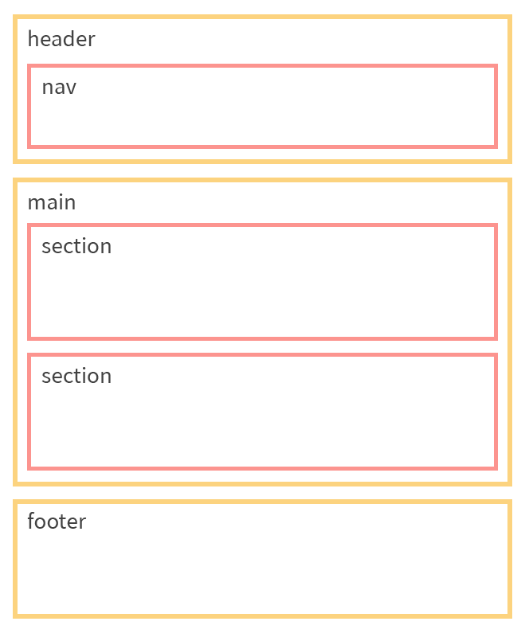

# HTML5 Practice

## 에밋\(Emmet\)

마크업 문서를 작성할 때, 매번 태그를 직접 열고 닫고 하는 일은 꽤나 번거롭습니다. 또한 `ul` 태그 안에 여러 번 반복되는 `li` 태그를 작성해야 하는 상황처럼, 반복되는 모든 태그를 일일이 직접 입력해야 한다면 매우 귀찮은 일일 것입니다. 그러나 지금 소개할 Emmet 플러그인을 사용하면, 몇 글자만 입력하고도 위와 같은 일을 매우 손쉽게 해낼 수 있습니다. [Emmet Cheat Sheet](https://docs.emmet.io/cheat-sheet/)에서 문법을 확인할 수 있으니, 가볍게 읽어보면서 자주 쓰이는 기본적인 문법 정도는 손에 익히는 것을 추천합니다.


VSCode에는 Emmet 플러그인이 내장되어있기 때문에 별도로 설치할 필요가 없습니다.


## 실습

[라인](https://line.me/ko/) 홈페이지를 따라 만들어보며 실습을 진행해보겠습니다.


### 실습 폴더 생성 및 github 연동

원하는 위치에 'web-tutorial'이라는 이름으로 폴더를 생성해주세요. 앞으로 진행할 모든 실습 파일을 이 폴더에 저장하고 관리할 것입니다.

또한 실습을 진행하는 동안 git을 사용하여 변경 내역을 기록할 것이기 때문에, 터미널에서 해당 폴더로 이동한 다음 `git init` 명령을 실행해주세요. 이 명령을 최초에 한 번 실행하고 나면, `git commit` 명령을 사용하여 변경 내역을 기록할 수 있습니다.

다음으로, 방금 생성한 로컬 저장소를 github의 원격 저장소와 연동하는 작업을 진행하겠습니다. 그러기 위해서는 새 원격 저장소가 필요하므로 [github](https://github.com)으로 이동한 후 우측 상단의 '+' 버튼을 눌러 새 원격 저장소를 생성해주세요. 저장소 이름은 아무렇게나 지어도 상관없지만 가급적이면 나중에 가서 헷갈리지 않도록 폴더 명과 동일한 'web-tutorial'로 짓는 것을 추천합니다.

원격 저장소를 생성하고 나면 해당 원격 저장소의 github URL을 확인할 수 있습니다. 이 URL을 복사한 다음, 연동하고자 하는 로컬 저장소 위치에서 다음 명령을 실행하면 두 저장소를 연동할 수 있습니다.

```bash
git remote add origin [원격 저장소 URL]
```

### 내용의 문서 구조를 먼저 생각하자

제대로 마크업을 하기 위해서는 HTML로 표현 가능한 범위에서 그 문서의 정보 구조\(문서 구조\)를 읽고 거기에 맞게 적절한 요소를 적용해가야 합니다. 이것은 웹페이지를 만드는 사람이 스스로 판단할 수 밖에 없습니다.

웹 문서를 작성할 때는 기본적으로 **헤더 영역과 콘텐츠 영역, 그리고 푸터 영역의 3단 구조**로 화면을 분할합니다. 이에 따라 LINE 웹페이지의 구조를 잡아보면 다음과 같이 나눌 수 있을 것입니다.



여기까지의 내용을 바탕으로 실제 HTML 코드를 작성해보겠습니다. web-tutorial 폴더에 line-web 폴더를 생성한 다음 VSCode로 실행해주세요.

먼저 HTML 문서의 기본 구조를 작성하겠습니다. 위에서 언급했던 Emmet 덕분에, 우리가 직접 수작업으로 작성할 필요없이 `!` 입력 후 탭 키를 누르기만 하면 자동으로 아래와 같은 기본 구조가 만들어집니다.

```markup
<!DOCTYPE html>
<html lang="en">
<head>
  <meta charset="UTF-8">
  <meta name="viewport" content="width=device-width, initial-scale=1.0">
  <meta http-equiv="X-UA-Compatible" content="ie=edge">
  <title>Document</title>
</head>
<body>

</body>
</html>
```

우리가 제작할 웹 페이지는 한국어로 작성될 것이기 때문에, 적절한 접근성을 제공할 수 있도록 html 태그에 명시된 `lang` 속성의 값을 `ko`로 변경해주겠습니다. **화면 낭독 프로그램\(스크린 리더\)은 이** `lang` **속성의 값을 읽어들여 해당 언어에 적합한 발음을 제공**해줍니다.

필수는 아니지만, 스타일링 상의 이유로 `body` 태그 아래에 컨테이너 역할을 할 최상단 `div` 태그 하나를 위치시키는 경우가 많습니다. 여기서도 'container'라는 이름의 최상단 `div` 태그를 하나 생성한 다음, 그 아래에 나머지 구조를 작성해나가겠습니다.

Emmet의 도움으로, 아래처럼 입력한 다음 탭 키를 누르기만 하면 자동으로 구조가 생성됩니다.

`div.container>header.header>nav.nav^main.main>section*2^footer.footer`

여기서 `div.container`와 같이 쓰는 것은 'container'라는 이름의 클래스를 가진 `div` 태그를 생성하겠다는 의미인데, 클래스는 나중에 HTML 문서 상의 특정 요소를 선택하여 스타일을 입히는 데 사용됩니다.

```markup
<div class="container">
  <header class="header">
    <nav class="nav"></nav>
  </header>
  <main class="main">
    <section></section>
    <section></section>
  </main>
  <footer class="footer"></footer>
</div>
```

### 문서의 표제 찾기

문서 구조를 생각할 때 기본이 되는 것이 '표제'입니다. 무슨 정보가 쓰여 있는지 의식하면서 콘텐츠 정보를 그룹으로 나누고 각 그룹의 표제에 해당하는 부분을 '표제 요소'로 지정하도록 합니다.

표제를 나타내는 헤딩 요소는 표제 레벨에 따라 `h1`에서 `h6`까지 6단계가 있습니다. 최상위 표제가 `h1`이며 이것은 필수적으로 페이지에 1개가 있습니다. `h2` 이하는 문서 구조에 따라 적당히 사용할 수 있으나 중간 레벨을 건너뛰거나 레벨의 상하 관계를 바꾸는 것은 원칙적으로는 불가능합니다. `h1` ~ `h6`의 표제 요소로 만들어진 트리 구조는 그대로 HTML 문서 구조의 골격이 됩니다.

그러면 먼저, 문서의 가장 큰 표제를 찾아보겠습니다. 우리가 작성하고 있는 LINE 웹페이지의 가장 큰 표제는 무엇이 적당할까요? 아마 당연하게도 LINE 웹페이지이므로 좌측 상단의 LINE 로고가 가장 큰 제목\(`h1`\)으로 적당할 것 같습니다.

```markup
<header>
  <h1 class="logo"><a href="#">LINE</a></h1>
</header>
```

여기까지 작성한 다음 브라우저로 띄워보면, `h1`으로 마크업한 부분에 상하 여백이 들어가고 글자 두께가 두꺼워진 것을 확인할 수 있습니다. 내가 원하는 스타일로 보이지 않는다고 해서 걱정할 필요는 없습니다. 나중에 CSS를 사용해서 얼마든지 변경할 수 있으니깐요. 마크업 단계에서는 정보를 의미있게 구조화하는 일에만 신경쓰면 됩니다.

또 한 가지, 자세히 들여다보면 LINE 로고는 텍스트가 아닌 이미지이기 때문에 `img` 태그로 마크업해야 하는 것이 아닌가 의문이 들 수도 있습니다. 그러나 `h1` 태그 내에 `img` 태그만 달랑 넣어두게 되면, 데이터를 수집하는 로봇은 이미지 내에 쓰여진 텍스트를 읽어내지 못하기 때문에 문서의 적절한 제목을 뽑아내지 못하게 됩니다. 따라서 지금처럼 제목을 텍스트로 처리한 다음, 스타일을 입히는 단계에서 IR\(Image Replacement\) 기법을 통해 텍스트를 숨기고 이미지로 대체해주는 것이 더 나은 방법입니다.

### 정보의 그룹화

정보를 그룹화하기 위해서는 기본적으로 `div` 요소를 사용합니다. `div` 요소 자체에는 표제나 단락 같은 문서 구조로서의 의미는 없으므로 '문서의 의미부여'라는 것에서는 불필요하지만 다음과 같은 목적으로 웹 제작을 할 때 아주 많이 사용합니다.

1. 정보를 정리할 때마다 소스를 그룹화하고 거기에 이름을 붙여 소스의 가독성을 높인다.
2. 레이아웃이나 디자인의 구현을 위해 필요한 범위를 지정한다.

HTML5 이전 버전에서는 '표제와 그에 따른 콘텐츠'처럼 문서 구조적으로 의미가 있는 그룹이라 해도 거기에 의미를 줄 수 있는 요소 자체가 존재하지 않았기 때문에 요소끼리 그룹화할 때는 일률적으로 `div` 요소를 사용했습니다.

그러나 HTML5에서는 '표제와 그에 따른 콘텐츠'같이 문서의 골격을 이루는 중요한 그룹에 새로운 전용 요소인 `section` 요소를 사용할 수 있습니다.

### 헤더 영역

마크업 작업은 내용이 복잡하면 복잡할수록 만드는 사람에 따라 차이가 생길 수 있기 때문에 절대적인 정답이 존재하지는 않습니다. 처음에 '정말 이 정도로 괜찮을까?'라는 고민이 들 수도 있을 겁니다. 하지만 마크업 본래의 역할과 각 요소의 의미를 고려해 작업하면 크게 잘못된 일은 없습니다. HTML 문서 구조는 그다지 까다롭거나 복잡하지 않기 때문에 우선은 **요소의 의미를 생각하면서 부적절한 것은 선정하지 않는다는 목표**로 시작하도록 합니다.

구조는 기본적으로 다음과 같은 순서로 잡습니다.

1. 영역을 구분한다.
2. 어떤 태그를 사용할지 정한다.
3. 각 요소를 클래스와 아이디로 네이밍한다.
4. 특정 이벤트가 발생했을 때 어떤 방식으로 처리할 것인지 판단한다. 그 이후에 더 합리적인 방법을 고민하면서 문제를 줄여나간다.

헤더 영역은 크게 네 부분으로 구분되어집니다. 전체 문서의 제목을 나타내는 영역과 네비게이션 영역, 다국어 선택 영역 그리고 외부 관련 사이트로 이동할 수 있는 외부 링크 영역입니다.

문서 제목 영역은 이미 위에서 작성하였으므로 넘어가고 네비게이션 영역을 마크업해보겠습니다. 각각의 탭 항목은 순서가 중요하지 않은 리스트 형식이므로 `ul` 태그를 사용해 마크업합니다. 이때 각 항목 사이에 구분자로 보이는 막대는 `span` 태그로 작성한 후 나중에 스타일을 입혀보도록 하겠습니다.

```markup
<ul>
  <li><a href="#">다운로드</a></li>
  <span class="item-seperator"></span>
  <li><a href="#">패밀리 앱</a></li>
  <span class="item-seperator"></span>
  <li><a href="#">게임</a></li>
  <span class="item-seperator"></span>
  <li><a href="#">LINE STORE</a></li>
</ul>
```

다음은 다국어 선택 영역입니다. 처음에는 버튼만 보여지다가 실제로 버튼을 클릭하게 되면 선택할 수 있는 언어의 리스트가 나열됩니다. 이처럼 사용자와 인터랙션이 필요한 부분은 자바스크립트를 통해 처리할 수 있는데, 지금은 우선 마크업에 집중하기로 하겠습니다.

```markup
<div class="intl">
  <button>한국어</button>
  <ul>
    <li>한국어</li>
    <li>English</li>
  </ul>
</div>
```

외부 링크 영역은 LINE 유튜브 계정과 페이스북 페이지로 이동할 수 있는 링크로 구성되어 있습니다. 각각의 링크는 이미지 형태로 표시되어있는데, 웹 문서에 이미지를 집어넣을 때 고민되는 것 중 하나는 '해당 이미지를 `img` 태그를 사용하여 HTML의 영역으로 처리할 것인가, `background` 프로퍼티를 사용하여 CSS의 영역으로 처리할 것인가'에 대한 문제입니다. 이 문제에 대한 명확한 정답은 존재하지 않습니다. 다만 'HTML은 오로지 문서의 정보 및 구조만 담당하고 CSS가 스타일과 관련된 부분을 책임지게 해야한다'는 관점을 고려해봤을 때, 해당 이미지가 문서의 어떤 정보를 나타내는 한 부분으로서의 역할을 맡고 있다면 `img` 태그로 처리하고, 단순히 장식을 위한 용도라면 CSS의 `background` 프로퍼티로 처리하는 것이 맞다는 게 일반적인 견해입니다. 더 자세한 내용은 [IMAGE TAG VS BACKGROUND PROPERTY](https://pawelgrzybek.com/image-tag-vs-background-property/)에서 확인하실 수 있습니다.

여기서 각 링크에 포함된 이미지는 해당 링크가 유튜브, 페이스북 페이지로 이동할 수 있는 링크라는 정보를 표현하고 있습니다. 그렇기때문에 각 이미지를 `img` 태그를 사용하여 나타내는 것이 더 적절해 보입니다.


이런 관점에서 생각해봤을 때, 문서의 표제인 로고 이미지도 `img` 태그로 처리하는 것이 더 적절한 방법입니다. 그러나 이 문제에 대한 절대적인 정답은 존재하지 않고 두 가지 방법을 모두 사용해보자는 뜻으로 표제 로고 이미지에 대한 처리는 CSS `background`프로퍼티를 사용하는 것으로 진행하겠습니다. 


`img` 태그를 사용할 때 주의할 점은, 접근성을 고려해 `alt` 속성을 명시해줘야 한다는 것입니다. 이미지가 표시되지 않는 환경에서 열었을 때 이미지를 대체할 텍스트로 `alt` 속성을 지정하는데, 이를 통해 이미지를 확인할 수 없는 상황에 놓인 사용자나 시각 장애인들은 눈으로 직접 확인하지 않고도 해당 이미지가 어떤 의미를 내포하고 있는지 파악할 수 있게 됩니다. 만약 이미지의 내용을 몰라도 특별히 문제가 되지 않는 경우라면 `alt=""` 형태로 값을 비워두면 됩니다. `alt` 속성을 명시하지 않으면 스크린 리더가 `src` 속성을 읽는 데 반해, 값이 비어있으면 스크린 리더는 해당 이미지를 읽지 않습니다.

> `img` 태그의 `alt` 속성을 빈 값으로 처리하게 되면 해당 이미지는 정보로서 아무 의미를 갖지 않습니다. 정보로서 의미를 갖지 않는 장식용 이미지라면, `img` 태그를 사용하지 말고 CSS의 `background` 프로퍼티를 사용하여 배치하는 것이 관심사의 분리라는 관점에서 훨씬 더 바람직합니다.

